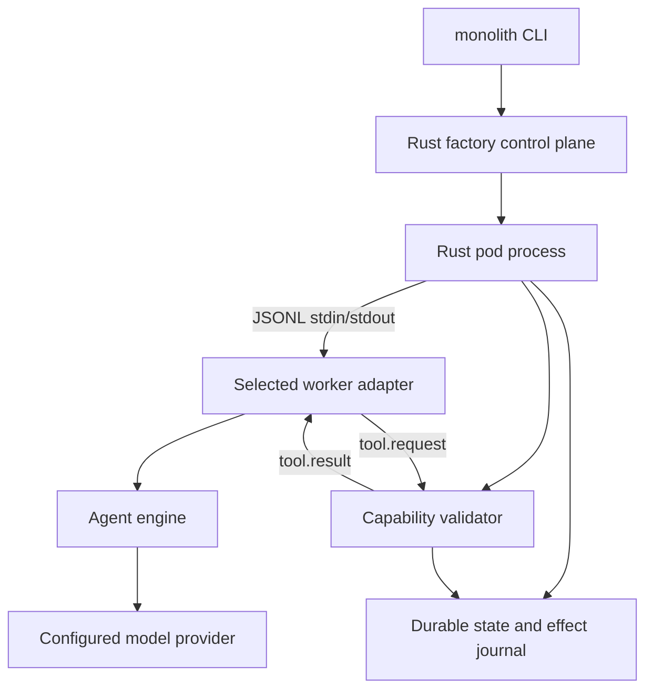

# Summary

Extend the Rust factory in `products/monolith-v2` with a model-enabled worker boundary.
Keep the factory, pod lifecycle, durable delivery, and capability policy in Rust.
Run the first model harness through a separate Pi Agent Core adapter.
Keep the wire protocol independent of Pi so another harness can replace it without a Rust control-plane rewrite.

The first release proves one useful workflow:

1. A declared pod receives a durable work message.
2. Its selected worker harness runs one bounded model turn.
3. The harness requests only declared capabilities through Rust.
4. Rust validates each capability request and persists the terminal result.
5. Rust emits a typed completion or failure message.

The release remains local and single-host.
It does not add remote deployment, a hosted control plane, multi-tenancy, billing, or durable model conversation memory.

---

## Problem frame

The current Rust rewrite already provides the control-plane foundation:

- `src/manifest.rs` parses the desired factory and pod state from TOML.
- `src/validation.rs` rejects unsafe or incomplete desired state.
- `src/runtime.rs` starts, observes, restarts, and stops local pod processes.
- `src/state.rs` stores factory state, message envelopes, inboxes, processed markers, and logs.
- `src/main.rs` exposes `validate`, `plan`, `apply`, `status`, `send`, `logs`, and `destroy`.

The current worker behavior is deterministic and fixed. It returns a hard-coded completion message. That proves process lifecycle and pod-to-pod delivery, but it does not prove agent execution.

The first LLM integration must not move control authority into the model runtime. It must also not make the Rust binary depend on one model harness. The correct seam is a local, versioned, capability-limited worker protocol over child-process standard input and output.

The existing Pi adapter at `tools/agent-harness-adapters/pi_core/run_pi_core_adapter.mjs` is reference material for Pi Agent Core wiring only. Its operator-TUI authority model is not the worker contract for this rewrite.

---

## Goal and non-goals

### Goal

Prove that one Rust-supervised pod can execute a bounded model turn through a replaceable worker harness while preserving Rust ownership of state, messages, process lifecycle, and side effects.

### Non-goals

- Do not expose shell, filesystem, HTTP, SSH, arbitrary MCP, or raw provider tools to the worker.
- Do not let the worker write factory state or message files directly.
- Do not claim exactly-once delivery or exactly-once side effects.
- Do not add remote VM, container, Kubernetes, or hosted execution.
- Do not add multi-user authorization or tenant isolation.
- Do not add long-lived conversation history beyond the durable work envelope and terminal result.
- Do not preserve the old operator-TUI adapter API as a compatibility layer.

---

## Requirements

### Engine-neutral worker contract

- R1. A pod manifest declares an opaque worker engine identifier, an executable argument vector, and opaque worker configuration.
- R2. Rust starts the executable as a child of the pod process without invoking a shell.
- R3. The worker protocol uses versioned JSON Lines over stdin and stdout.
- R4. The protocol defines handshake, work delivery, capability request, capability result, completion, failure, heartbeat, and cancellation messages without naming Pi types.
- R5. Rust treats the worker engine and worker configuration as data. Rust must not branch on provider, model, prompt, or harness-specific settings.
- R6. A second harness can implement the same protocol by changing only its adapter package and manifest command.

### Rust authority and capability policy

- R7. Rust remains the source of truth for pod identity, desired state, observed state, message envelopes, delivery status, and process lifecycle.
- R8. The worker can request only `pod.send_message` and `factory.read_state` in the first release.
- R9. Rust derives the caller identity from the supervised pod. It must not trust identity fields supplied by the worker.
- R10. Rust validates the destination pod, message kind, payload size, capability name, argument shape, and correlation ID before applying an effect.
- R11. Rust rejects unknown, malformed, duplicate, expired, or unauthorized capability requests without changing durable state.
- R12. The worker receives sanitized state projections. It never receives state-directory paths, process IDs for unrelated pods, secrets, or raw log files.

### Durability and failure semantics

- R13. Work delivery, capability requests, capability results, and terminal results carry stable IDs and correlation IDs.
- R14. Rust persists a terminal result before it marks the source delivery complete.
- R15. Replaying a delivery after a crash does not insert a duplicate message for an already-recorded effect key.
- R16. The documented delivery model is at-least-once. Effects use idempotency keys where the local state model supports them.
- R17. A worker timeout, malformed line, unexpected exit, protocol-version mismatch, provider error, or oversized message produces an observable failure state.
- R18. A dead worker can be restarted by the existing pod lifecycle without orphaning its child process or losing the durable source message.
- R19. One pod processes one model turn at a time. The supervisor applies bounded line, message, tool-call, turn, and process-output limits.

### Operator surface and evidence

- R20. `validate`, `plan`, `apply`, `status`, `send`, `logs`, and `destroy` continue to work with the worker boundary enabled.
- R21. Operator output identifies the pod, worker engine, worker state, current delivery ID, and safe failure reason.
- R22. Protocol stdout contains only protocol frames. Diagnostic output goes to stderr and the durable pod log.
- R23. Logs redact API keys, bearer tokens, cookies, authorization headers, provider response bodies, and worker configuration fields marked secret.
- R24. The existing deterministic test path remains available through a test worker fixture. It must not be an implicit production fallback when the configured worker fails.

---

## Architecture



The process hierarchy is:

```text
monolith apply
  └── Rust factory process
        └── Rust pod process
              └── selected worker adapter
                    └── model engine runtime
```

The factory owns the pod process. The pod process owns the worker adapter. The adapter owns the model loop. No worker process receives a direct state-directory capability.

### Protocol shape

The checked-in protocol schema will define these message families:

- `hello`: worker announces protocol version and engine label.
- `ready`: worker accepts the pod identity and is ready for work.
- `work.requested`: Rust delivers one durable work envelope.
- `tool.request`: worker asks Rust to perform one named capability.
- `tool.result`: Rust returns a success or failure for that capability request.
- `work.completed`: worker returns a bounded terminal result.
- `work.failed`: worker returns a safe failure code and message.
- `heartbeat`: worker and supervisor prove liveness during a turn.
- `cancel`: Rust asks the worker to stop the current turn.

Every frame includes `protocol_version`, `message_type`, `request_id`, and a bounded payload. Work and capability messages also include `delivery_id` or `tool_call_id` as appropriate.

A worker adapter must implement the protocol. It may map protocol messages to any internal engine API. Rust must not inspect internal engine events.

---

## Key technical decisions

- **KTD1. Rust owns control and effects.** The model runtime can propose work and request capabilities. Only Rust can mutate factory state, enqueue messages, mark delivery, start or stop processes, or declare terminal outcome.
- **KTD2. Use a versioned JSONL protocol.** JSONL works across Rust, Node, Python, and future harnesses. Versioned frames make incompatible adapters fail at startup instead of failing silently during a turn.
- **KTD3. Use a separate adapter process.** A child process isolates Node and provider failures from the Rust factory. It also permits a future adapter written in another language without changing the Rust binary.
- **KTD4. Keep the adapter command explicit but shell-free.** The manifest supplies an operator-owned argv vector. Rust passes arguments directly to `Command`. No shell interpolation or command string parsing is allowed.
- **KTD5. Keep worker configuration opaque to Rust.** Common limits and protocol settings are Rust-owned. Provider, model, prompt, and harness settings pass through an opaque JSON object. Secrets remain in the environment rather than the manifest.
- **KTD6. Serialize capability calls and turns.** The first release permits one in-flight turn and sequential capability calls. This limits ordering ambiguity, file races, and replay complexity.
- **KTD7. Document at-least-once delivery.** Stable delivery IDs and effect keys prevent duplicate local insertion where possible. External exactly-once behavior is not promised.
- **KTD8. Keep the first model turn stateless.** A restart replays the durable work envelope instead of reconstructing a hidden conversation. Durable memory is a later product decision.
- **KTD9. Pin the Pi dependency surface.** The first adapter pins compatible `@mariozechner/pi-agent-core` and `@mariozechner/pi-ai` versions. Adapter tests use the public Agent Core event and tool contracts, not private implementation details.

---

## Implementation units

### U1. Define the neutral worker protocol and manifest model

- **Goal:** Add a cross-language contract that contains no Pi-specific Rust types.
- **Files:**
  - `src/manifest.rs`
  - `src/validation.rs`
  - `src/worker_protocol.rs` (new)
  - `protocol/agent-worker-v1.schema.json` (new)
  - `Cargo.toml`
- **Changes:**
  - Add a worker declaration to the manifest with `engine`, shell-free `command` argv, and opaque `config`.
  - Add serde types for protocol frames, frame kind, request IDs, delivery IDs, tool-call IDs, safe errors, and terminal results.
  - Enforce non-empty engine and command values, bounded configuration size, and valid JSON-compatible configuration.
  - Keep worker configuration out of `FactoryState` snapshots unless the field is explicitly marked safe for display.
  - Add the protocol schema and representative success, denial, malformed, and failure fixtures.
- **Tests:**
  - Valid worker declarations parse from TOML.
  - Empty engine and empty command declarations fail validation.
  - Shell metacharacters remain ordinary argv data and are never interpreted.
  - Unknown protocol versions and unknown required frame fields fail closed.
  - Oversized payloads fail before process launch or state mutation.
- **Verification:** `cargo fmt --check`, focused protocol and manifest tests, and `cargo check`.

### U2. Add a Rust worker supervisor and capability host

- **Goal:** Supervise one adapter child per pod and expose only Rust-gated capabilities.
- **Files:**
  - `src/worker_supervisor.rs` (new)
  - `src/runtime.rs`
  - `src/state.rs`
  - `src/main.rs`
  - `src/validation.rs`
- **Changes:**
  - Launch the configured adapter with piped stdin, stdout, and stderr.
  - Keep stdout reserved for protocol frames. Append stderr to the existing pod log with redaction.
  - Require `hello` and `ready` before delivering work.
  - Deliver one `work.requested` frame at a time.
  - Read frames with line and total-frame limits. Reject malformed JSON, unknown required fields, protocol mismatches, and out-of-order frames.
  - Enforce turn and heartbeat deadlines. Send `cancel` before terminating an unresponsive worker.
  - Reap the worker on normal completion, timeout, protocol failure, pod shutdown, and restart.
  - Use the existing pod process boundary for lifecycle ownership. Ensure the worker cannot survive a pod replacement by using an explicit process-group or equivalent child-cleanup strategy for the supported Unix runtime.
  - Implement `factory.read_state` as a sanitized projection of factory and pod status.
  - Implement `pod.send_message` by calling the existing durable enqueue path after Rust validation.
  - Record source delivery, tool-call effect keys, and terminal result state in the existing state directory. Extend the state layout only where the current message and processed-marker files cannot represent the needed transition.
- **Tests:**
  - A fake adapter completes a work request and produces one durable terminal result.
  - A fake adapter requests a valid send and receives a success result.
  - A fake adapter requests an unknown tool, invalid destination, oversized payload, or forged identity and receives denial with no state mutation.
  - A worker that exits before `ready` produces a visible pod failure.
  - A worker that exits after a capability effect but before terminal completion can be replayed without duplicate message insertion.
  - A worker that emits malformed or oversized frames is terminated and leaves a safe failure record.
  - Destroy and restart remove the adapter child and do not leave an orphan process.
- **Verification:** Focused Rust tests plus a temporary-directory lifecycle smoke test using the fake adapter.

### U3. Build the first Pi Agent Core adapter

- **Goal:** Map the neutral protocol to Pi Agent Core without moving policy into Node.
- **Files:**
  - `workers/pi/package.json` (new)
  - `workers/pi/package-lock.json` (new)
  - `workers/pi/worker.mjs` (new)
  - `workers/pi/protocol.mjs` (new)
  - `workers/pi/test/worker.test.mjs` (new)
  - `workers/pi/README.md` (new)
- **Changes:**
  - Read protocol frames from stdin and write protocol frames to stdout.
  - Send diagnostics only to stderr.
  - Validate the Rust handshake before constructing an Agent Core instance.
  - Map `work.requested` to one bounded Agent Core prompt.
  - Expose only two adapter tools: `pod.send_message` and `factory.read_state`.
  - Convert each tool invocation into a `tool.request` frame. Wait for the matching `tool.result` before continuing the model loop.
  - Use sequential tool execution. Do not expose a direct HTTP, shell, filesystem, MCP, or provider client tool.
  - Convert the final model text into a bounded `work.completed` result. Convert provider, tool, parse, and abort failures into `work.failed` with safe error codes.
  - Read provider credentials from environment variables supported by the selected Pi provider. Do not print credentials or provider response bodies.
  - Pin the Pi packages to the verified public API surface. Keep the adapter independent from the legacy operator-TUI runner.
- **Tests:**
  - Protocol handshake succeeds with a fake Agent Core stream.
  - One prompt produces one completion frame.
  - A model tool call blocks until Rust returns the matching result.
  - A denied tool result reaches the model as a normal tool failure and does not bypass Rust.
  - Malformed Rust frames and cancellation terminate the turn safely.
  - Adapter stdout contains only valid protocol frames.
- **Verification:** `npm ci` and `npm test` inside `workers/pi`, then a live smoke test with a configured model provider when credentials are available.

### U4. Wire the worker boundary into the factory CLI and golden path

- **Goal:** Make the engine-neutral worker path observable through the existing operator commands.
- **Files:**
  - `src/main.rs`
  - `src/runtime.rs`
  - `src/state.rs`
  - `examples/demo.toml`
  - `examples/pi-demo.toml` (new)
  - `examples/stub-worker/worker` (new executable fixture)
  - `README.md`
- **Changes:**
  - Replace the hard-coded worker reply path with the generic supervisor path.
  - Extend command output for `plan`, `apply`, `status`, `send`, `logs`, and `destroy` with worker engine and worker-state fields.
  - Keep the deterministic fixture for local acceptance tests. Make it an explicit worker command, not an automatic fallback.
  - Add a Pi example that contains provider and model configuration but no secrets.
  - Fail preflight when the configured adapter command cannot start. Do not create partial pod state.
  - Preserve apply idempotency and destroy cleanup.
  - Document the worker protocol boundary, capability list, failure semantics, secret handling, and adapter replacement contract.
- **Tests:**
  - The existing golden path runs with the explicit deterministic fixture.
  - The Pi example passes manifest validation without credentials and fails at apply with a clear provider or command preflight error rather than a partial factory.
  - CLI status and logs expose safe worker state and delivery identifiers.
  - Repeated apply does not duplicate a running worker or durable message.
  - Destroy leaves no managed pod or worker process.
- **Verification:** Run the full local acceptance sequence in a clean temporary state directory:

  ```bash
  monolith validate examples/demo.toml
  monolith plan examples/demo.toml --state-dir /tmp/monolith-v2-demo
  monolith apply examples/demo.toml --state-dir /tmp/monolith-v2-demo
  monolith status /tmp/monolith-v2-demo
  monolith send /tmp/monolith-v2-demo --from planner --to worker --kind work.requested --payload '{"task":"complete the example"}'
  monolith logs /tmp/monolith-v2-demo worker
  monolith destroy /tmp/monolith-v2-demo
  ```

### U5. Add cross-language contract, crash, and release verification

- **Goal:** Prove the seam rather than only proving that each process compiles.
- **Files:**
  - `tests/worker_contract.rs` (new)
  - `tests/worker_lifecycle.rs` (new)
  - `workers/pi/test/fixtures/` (new)
  - `README.md`
  - `Cargo.lock`
  - `workers/pi/package-lock.json`
- **Changes:**
  - Run the same protocol fixtures through Rust and the Pi adapter parser.
  - Add crash injection points before handshake, after work receipt, after each capability result, before terminal persistence, and after terminal persistence.
  - Assert durable state after every crash point.
  - Assert no duplicate local effect for a replayed effect key.
  - Assert process cleanup after timeout, restart, and destroy.
  - Add a replacement-harness fixture that is not Pi. It must complete the same contract without Rust changes.
  - Record the supported Node version, package versions, provider environment contract, and local Unix process assumptions.
- **Verification:** Run Rust format, focused tests, full Rust tests, adapter tests, the golden path, and the replacement-harness contract test. Run a live Pi turn only when a model credential is present.

---

## Key flows and acceptance examples

### AE1. One model turn completes

- **Given:** A valid factory declares one pod with a working engine-neutral adapter command.
- **When:** Rust delivers one work envelope and the adapter returns a bounded completion.
- **Then:** Rust persists the terminal result before acknowledging the source delivery. `status` shows the worker as healthy or idle. No duplicate completion exists after a repeated status read.
- **Covers:** R1, R3, R7, R13, R14, R20, R21.

### AE2. The model requests a permitted pod message

- **Given:** The worker asks for `pod.send_message` with a declared destination and valid payload.
- **When:** Rust validates the request and applies the existing enqueue path.
- **Then:** The destination inbox contains one message with the Rust-derived source pod and the request effect key. The worker receives a matching `tool.result`.
- **Covers:** R8, R9, R10, R13, R15.

### AE3. The model requests a forbidden capability

- **Given:** The worker asks for shell, filesystem, HTTP, raw MCP, or an unknown capability.
- **When:** Rust receives the request.
- **Then:** Rust returns a denial. Rust does not mutate state. The pod log records a safe policy failure.
- **Covers:** R8, R10, R11, R22, R23.

### AE4. The worker crashes during a turn

- **Given:** The worker exits after Rust applied one local capability effect but before it returns a terminal result.
- **When:** The supervisor detects the exit and the pod restarts.
- **Then:** Rust replays the source delivery. The prior effect key prevents duplicate insertion. The second worker can complete the turn or produce an observable failure.
- **Covers:** R14, R15, R16, R17, R18.

### AE5. A replacement harness uses the same contract

- **Given:** A non-Pi fixture implements the same JSONL protocol and accepts the same work frame.
- **When:** The manifest changes only its worker engine metadata, command, and opaque configuration.
- **Then:** Rust starts it, validates the same frames, applies the same capabilities, and persists the same terminal result shape.
- **Covers:** R3, R5, R6, R7, R20.

### AE6. Apply and destroy are repeatable

- **Given:** A factory has running pods and an active worker.
- **When:** The operator runs apply twice, then destroy.
- **Then:** Apply does not duplicate workers. Destroy stops the pod and its adapter child. No managed process remains. State records the stopped result.
- **Covers:** R18, R20, R21.

---

## Risks and mitigations

- **Protocol drift:** Pin protocol version in every frame. Reject unsupported versions during handshake. Run shared fixtures in Rust and Node.
- **Child-process orphaning:** Make the pod process the lifecycle owner. Use process-group cleanup or an equivalent Unix child-reaping strategy. Test timeout, restart, and destroy.
- **Duplicate side effects:** Persist effect keys before acknowledging capability success. Recheck keys on replay. Document at-least-once semantics.
- **Model provider failure:** Bound each turn. Convert provider errors to typed `work.failed` frames. Do not retry inside the adapter without a bounded policy because hidden retries change delivery semantics.
- **Secret leakage:** Keep credentials in environment variables. Redact worker configuration and provider errors. Keep adapter stdout protocol-only.
- **Pi API churn:** Pin exact package versions. Keep all Pi-specific code under `workers/pi`. Test against the public Agent Core event and tool types.
- **Backpressure and runaway output:** Limit line length, frame size, tool-call count, turn duration, and log tail size. Terminate a worker that exceeds a limit.
- **Cross-language type mismatch:** Use a checked-in JSON schema plus fixtures. Test Rust serialization and Node parsing against the same files.
- **False engine neutrality:** Do not add Pi conditionals to Rust. The only Rust worker-specific input is the shell-free command vector and opaque configuration.
- **Unsafe manifest commands:** Treat the manifest as operator-owned desired state. Never pass its command through a shell. Show the command in plan output with secret fields redacted.

---

## Verification matrix

| Area | Proof | Required result |
|---|---|---|
| Manifest | Rust parser and validation tests | Invalid worker declarations fail before process launch |
| Protocol | Shared JSON fixtures in Rust and Node | Both sides accept the same valid frames and reject invalid frames |
| Capability policy | Focused supervisor tests | Forbidden requests cause no state mutation |
| Durability | Crash injection at every transition | Replay is safe and terminal state remains inspectable |
| Lifecycle | Temporary-directory process smoke tests | Apply, restart, and destroy leave no orphan worker |
| CLI | Golden path with deterministic fixture | Existing commands remain usable and report worker state |
| Engine replacement | Non-Pi fixture adapter | Rust behavior is unchanged when the adapter changes |
| Pi integration | Adapter tests plus optional live turn | Pi maps one bounded turn and tool call to the neutral protocol |
| Security | Redaction and shell-free launch tests | Secrets do not enter logs and commands are not shell-expanded |

The cheapest assumption to invalidate before implementation is that the selected Pi Agent Core package version can maintain one bounded turn while waiting for Rust-owned tool results over a JSONL adapter. The adapter contract test should check that assumption first.

---

## Research breadcrumbs

- Current Rust control-plane files: `src/manifest.rs`, `src/validation.rs`, `src/runtime.rs`, `src/state.rs`, and `src/main.rs`.
- Existing process adapter reference: `tools/agent-harness-adapters/pi_core/run_pi_core_adapter.mjs`.
- Existing product direction and boundary: `documentation/advisory/README.md` and `documentation/shared/CANONICAL_SOURCES.md` at the repository root.
- Pi extension and adapter documentation: https://pi.dev/docs/latest/extensions
- Pi Agent Core public type declarations: https://unpkg.com/@mariozechner/pi-agent-core@0.73.1/dist/types.d.ts
- Pi Agent Core package metadata checked during planning: `@mariozechner/pi-agent-core@0.73.1`.
